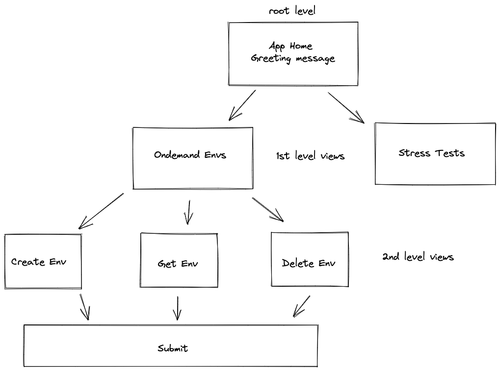
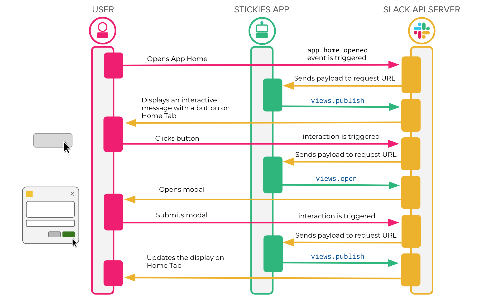

# slack-bot
Example of slack-bot on python adapted to classic [MVC architecture pattern](https://www.freecodecamp.org/news/the-model-view-controller-pattern-mvc-architecture-and-frameworks-explained/) 
 

## Project structure
`Views` - representation of UI in slack. Maybe message structure of modal view(pop-up form)  
`Drivers` - way to communicate with external resources, 3rd party integrations ( k8s, database, inventory system, monitoring, etc...)  
`Controllers` - reaction to user actions and not only  
_Aggregated by 1st level view functionality_

## Bot structure
For the time being bot designed as following 

### `root level`
App home view, bot mentions with `@bot`, calling bot with `/bot`
All actions will result in similar message (either in the same channel or in the app messages) with list of `1st level views`

### `1st level views` 
Aggregation of actions of the same service/tool/etc  
Example: `Ondemand Environment`. This view will show all actions that you can do with ondemand envs: create/update/check status/delete
Another example that may be added in future - `Stress tests`  (controller not implemented yet)
Same approach: create/update/check status/delete/etc  

It also may be a collection of links of the same topic, to easier access for new memebers/oncalls/etc  
Example: Monitoring topic, which will have links to datadog / logzio / grafana / elk / whatever else  
In this particular case, there may be no `2nd level view` as there is no addition functionality needed. just forward user to the link

### `2nd level views` (Optional)
Mainly User Input views. For example creation of ondemand environment  
User will insert parameters that will be used to create environment:  
- Name
- Image tag
- DB details
- etc

Upon pressing submit button bot will trigger creation of ondemand Env with help of the specific driver

## Events flow

_Pic from [this tutorial](https://api.slack.com/tutorials/app-home-with-modal#building-a-home-for-your-app---learn-how-to-create-the-app-home-view-and-use-the-modals__setting-up-your-app)_


## Troubleshooting
Invalid arguments in the logs and not generated view in most cases means not correct json sent to slack
You can validate any json blocks [here](https://app.slack.com/block-kit-builder/TPUQK1ZGQ)  


## Development
In order to add new functionality need to add following parts:
`views`:
- json template with view representation (what user will actually see)
- json template with response representation (if any)
- functions to render mentioned jsons
`controllers`:
- New file if it is new `1st level view`
- Registration of the view rendering based on action id
- function to react on user actions 

### Action ID
action id has to match in the json view and in the controller, when registering action for this view. To minimize errors, there is a helper func `GetViewID` that creating action ids and block ids and it is used in both controllers and view rendering.
It has 3 parameters:
- view - parent view, where this functionality will be shown
- block_id - block meaning
- action_id - if only 1 input in block, `GenericAction` should be used, if multiple actions, than custom string

all 3 filed should be declared as constants in the view where it will be used.
This is done for ease of using the same IDs in the controller

[More info about blocks in slack](https://api.slack.com/reference/block-kit/blocks#actions)  
Json example
```json
{
	"type": "modal",
	"callback_id": "get_env_status_submit",
	"title": {
		"type": "plain_text",
		"text": "Ondemand env status"
	},
	"close": {
		"type": "plain_text",
		"text": "Cancel",
		"emoji": true
	},
	"submit": {
		"type": "plain_text",
		"text": "Get",
		"emoji": true
	},
	"blocks": [
		{
			"type": "header",
			"text": {
				"type": "plain_text",
				"text": "Get ondemand env status",
				"emoji": true
			}
		},
		{
			"type": "input",
			"block_id": "{{ .NameBlock }}",      <----- Block id
			"label": {
				"type": "plain_text",
				"text": "Env name",
				"emoji": true
			},
			"element": {
				"type": "plain_text_input",
				"multiline": false,
				"action_id": "{{ .NameAction }}",     <------ Action id
				"placeholder": {
					"type": "plain_text",
					"text": "storybook",
					"emoji": true
				}
			}
		}
	]
}
```

Also, if action is an actual user input, `block id` and `action id` will be used to access this input data in the request that slack will send to bot
